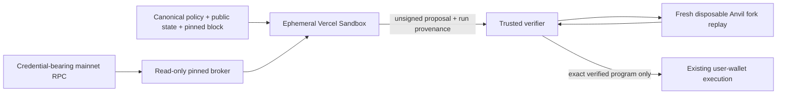

# Coding-agent sandbox v1

## Scope

This is a deliberately narrow vertical slice for X Layer mainnet (`196`). It
does not replace deterministic-v2 or the existing buyer-wallet execution lane.
It accepts an agent-authored unsigned program only for an ERC-20 `approve`
followed by an Aave V3 `supply`; every target is supplied by a verifier-owned
deployment/capability manifest. Curve, Uniswap, LP, flash-loan, lending exit,
staking, bridge, and arbitrary-call composition are not capabilities of v1.

The input task contains only the canonical policy, wallet address, public
portfolio state, trusted manifest, and pinned snapshot block. It has no private
key, seed phrase, wallet provider, transaction API, database URL, production RPC
URL, or environment inherited from Cobia.

## Data flow

The sandbox can install dependencies and run arbitrary code within its own
microVM. Its network policy allows only the task-specific read broker plus the
small official/docs package-host allowlist. The browser wallet is never exposed
to it. The configured broker normalizes requests into a small allowlist and
pins stateful reads to the snapshot block; it rejects all `eth_send*`, signing,
`wallet_*`, `personal_*`, malformed, and unlisted RPC methods.

`@vercel/sandbox` is the chosen worker substrate: Vercel documents Firecracker
microVM isolation, ephemeral filesystems, command/file APIs, resource limits,
and explicit egress policy. The app adapter uses a non-persistent `node24`
sandbox, two vCPUs, a five-minute ceiling, no exposed ports, and a
credential-free broker URL. An authenticated broker deployment is still an
activation prerequisite; this branch intentionally adds no public route that
could launch an unbounded paid agent job.

## Independent verification

The agent outputs a canonical proposal, never an authorization decision. The
trusted verifier checks the policy commitment, owner, chain, deadline, snapshot
freshness, target code identity, proxy implementation identity, selector
semantics, zero native value, bounded approval, Aave asset/amount/recipient,
and policy-derived minimum final balance. It then compares the supplied
simulation evidence with a second replay's receipts, trace hash, state-diff
hash, final balances, and deployment identities.

The replay is permitted to mutate only an isolated Anvil fork. It impersonates
the address only inside that fork and uses `anvil_setBalance`,
`anvil_impersonateAccount`, `eth_sendTransaction`, and
`anvil_stopImpersonatingAccount`; no code path sends a principal transaction to
X Layer mainnet. The production lane remains the existing per-transaction user
wallet confirmation flow and must rebuild/recheck the verified sequence before
asking the wallet to sign.

## Evidence and provenance

The runner records command stdout/stderr hashes, declared commands, dependency
versions, source URL/content hashes, and hashes of generated files. Output and
declared paths are constrained to relative workspace paths; symbolic-link
artifacts are rejected. Provenance helps reproduce a run but is not proof of
safety. ABI or documentation retrieval likewise does not establish a target's
semantic authority; the manifest and verifier do.

## Residual limitations before beta activation

- Connect a privileged, authenticated broker/proxy to the Vercel sandbox egress
  policy; do not expose the upstream RPC URL to a sandbox or browser.
- Provision a pinned coding-agent command/model credential broker and run the
  opt-in real X Layer fork acceptance case with a wallet that has the stated
  public USDG balance. No paid model invocation is performed by this change.
- Add each future protocol action with decoder, identity checks, event/state
  postconditions, and adversarial fork tests before adding it to the manifest.
- Deploy a bounded on-chain executor before claiming atomic multi-protocol
  final-balance enforcement. Async bridges cannot share that guarantee; future
  APY, LP fees, and impermanent loss remain forecasts, not enforced returns.
