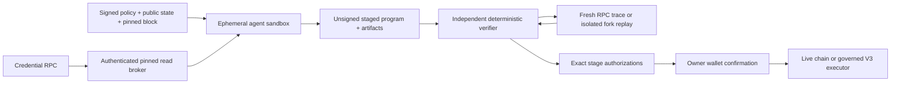

# Coding-agent sandbox v1

## Implemented boundary

General on-chain intents use a genuine coding-agent path. The input is a canonical signed
policy, wallet address, public balances/allowances/positions, trusted deployment
manifest, and pinned X Layer mainnet (`196`) block. The agent receives no private
key, seed phrase, wallet provider, database URL, production RPC credential, or
production send method.

Generation is open-world; authorization is closed-world. The sandbox can install
packages, retrieve allowlisted official sources, write route-search code, and run
tools in its disposable filesystem. It emits a strict `TransactionProgramV1`,
provider artifacts, evidence, and provenance—not raw trusted calldata and never
a safety verdict. An ABI, SDK, document, quote, or agent claim is not trust
evidence.

Cobia now has two verification lanes:

- the bounded V3 executor lane compiles verifier-owned Aave V3 supply, Curve
  StableSwap NG exact-input, and Uniswap V3 exact-input capabilities and can
  enforce a synchronous final balance onchain; and
- the Open V3 wallet lane verifies exact raw EVM stages and adds LI.FI and OKX
  provider semantics when those artifacts are present. It binds calldata,
  approvals, value, owner, recipients, code identities, complete state deltas,
  anchor freshness, and independent replay to the signed policy.

The second lane makes the proposal architecture protocol-open; it does not make
every protocol or outcome production-executable. Signed community-decision
intake, production replay dispatch, staged receipt reconciliation, and the
multi-chain browser client remain release blockers. Unknown semantics may be
returned as `research` or abstention, never upgraded into authorization.

## Data and authority flow

The model API key remains in the coordinator and is used only for the model
request; it never enters sandbox commands or files. The broker URL is
credential-free and bound to the exact Vercel team, project, host, sandbox name,
job UUID, running state, and pinned block. It rejects JSON-RPC batches,
credential-bearing requests, malformed method names, all `eth_send*`, signing,
`wallet_*`, `personal_*`, pending state, and unlisted methods. Allowed stateful
reads are rewritten to the pinned block.

The runtime uses non-persistent Node 24 sandboxes, two vCPUs, a five-minute
timeout, no public ports, and an explicit egress allowlist. One sandbox runs the
agent. When RPC simulation cannot produce the required trace and state-diff
evidence, a distinct sandbox installs pinned Anvil 1.7.1 and performs trusted
replay. Only the disposable fork permits impersonation and
`eth_sendTransaction`; it is evidence generation, never a production fallback.

## Verification and execution

The verifier checks the policy and program commitments, owner, chain, input
amount, objective, deadline, block anchor and freshness, typed parameters,
selectors, native values, spend and allowance bounds, recipients, final-balance
constraints, asset conservation, deployment runtime hashes, and proxy
implementation identities. V3 capabilities additionally require their active
registry semantics. Open wallet stages require fresh provider or raw-call
artifacts, state deltas, trace evidence, and independent reproduction. A fork is
used only when the required evidence is unavailable from bounded RPC simulation.

Accepted programs are persisted as immutable artifacts: pinned public-state snapshot, program, agent evidence,
provenance, verifier verdict, trusted replay, projected execution, authorization,
and eventual receipt. Provenance captures model response IDs, dependency
versions, fetched source hashes, generated-file hashes, commands, exit codes, and
stdout/stderr hashes. Safe relative paths are required; artifacts are read once
with no-follow semantics and bounded size, so traversal and symbolic-link output
substitution fail closed.

The coding agent never decides safety and never signs. In the V3 lane, the
trusted coordinator may sign only the exact EIP-712 executor authorization after
verification. Before the UI offers that execution, the server rechecks chain
196, executor code hash, risk manager and capability-registry pause state,
verifier signer, owner authorization, token enablement, per-route cap, immutable
artifacts, deadline, and snapshot freshness. The owner wallet confirms bounded
ERC-20 approvals and then the exact atomic executor call. The receipt is
accepted only when its from/to/value/input and `ProgramExecuted` commitment
match.

For Open V3, the verifier instead returns exact per-stage requests. That lane is
not yet exposed for production wallet execution: it still needs signed external
decision intake, production replay dependencies, immutable stage/receipt state,
and the chain `1 | 196` wallet review flow. No existing V3 endpoint is used as a
fallback for an open program.

The public product now uses only `/intents`, immutable solver submissions, and
`/programs/:submissionId`. The earlier request/market/purchased-route pages and
APIs are removed rather than retained as compatibility fallbacks. Historical
payment and execution rows remain database audit records and Activity labels
them as archived; they cannot produce a fresh authorization.

Discover also publishes manifest-bound standing challenge templates. These are
not quotes or evergreen authorizations. Selecting one copies only its human goal
and strictly validated capability fields into a new unsigned editor; the owner,
request ID, nonce, time bounds, signature, snapshot, program, and evidence are
always newly created.

The route itself is one transaction and therefore rolls back atomically. An
ERC-20 approval may still be a preceding owner transaction. OKX Wallet documents
EIP-5792 `wallet_sendCalls` with `atomicRequired: true`, but Cobia will not switch
to wallet batching until its X Layer sender semantics and receipt attribution are
proven against this executor. There is no sequential fallback hidden behind an
"atomic batch" label.

OKX gas subsidy is a different product boundary. Its current X Layer payment
flow uses EIP-3009 or Permit2 credentials and a facilitator for supported
USDG/USD₮0 payment settlement. It does not make arbitrary DeFi executor calls
gasless. Cobia therefore requires OKB for general mainnet execution and reserves
"gasless" for a separately verified payment capability.

X Layer mainnet transactions are attributed with the registered Builder Code
`sq6dlj2onr8ml5xa`. The registered payout address is the Cobia operator
`0xB6da8E6d497bd3Bc5016416DA57d177085449124`; registration transaction
`0xf9ee439cbc68a652f92c8d7522d8c76a54e6c3888ffde7468eb7ed32c6318ffa`
is public chain evidence, not signing authority. The trusted coordinator adds
the ERC-8021 suffix before committing the verifier artifact. Execution
preflight reconstructs that exact suffixed executor calldata, bounded approvals
carry the same suffix, and receipt attribution requires byte-for-byte equality.
The wallet never appends mutable attribution after verification.

The current synchronous web slice fails closed within bounded stages: the
coding-agent microVM has a 170-second lifetime with a 160-second model/shell
budget, and the separate fresh-fork microVM has a 100-second lifetime. This
leaves cleanup and persistence headroom under the 300-second route ceiling.
Long-term solver hosting and queue topology are intentionally deferred; these
limits describe the implemented path, not a commitment to its final host.

## Threat model

- Prompt or package compromise is contained by a disposable microVM, bounded
  commands/time/resources, no inherited secrets, no exposed port, and egress
  allowlisting.
- RPC method casing, malformed encoding, batching, signing, wallet methods, sends,
  credentials, stale jobs, wrong sandbox identities, chain mismatch, and unpinned
  reads fail closed.
- Path traversal and symbolic-link artifact substitution fail closed; stored
  artifact hashes are recomputed before execution.
- Agent evidence, ABI, docs, and simulations are untrusted until independently
  compiled, identity-checked, and reproduced.
- Proxy upgrades, code changes, reorg/stale anchors, expanded target/value/
  recipient/allowance, insufficient final balances, and asset-flow violations
  produce explicit rejection or execution-unavailable errors.
- The executor snapshots its prior token balances and rejects routes that consume
  them, so one user cannot sweep or subsidize execution with stranded funds.

## Guarantees and non-guarantees

The executor can atomically enforce deadline, authorized targets, route caps, and
minimum final token balances for synchronous EVM actions. Asynchronous bridges
cannot share that guarantee. Future APY, future LP fees, impermanent loss, and
future asset prices cannot be guaranteed. Flash-loan research may run only on a
fork and can be admitted later only with verified atomic repayment and final
profit bounds.

## Remaining activation and Open V3 work

1. Complete the delayed Safe activation for the deployed V3 risk manager
   `0xc69A…1ded` and executor `0xa31d…31A0`. Both creations and identities were
   independently reproduced, but the controls remain paused until the proposal,
   48-hour delay, activation, and final read-back finish.
2. Implement signed community decision intake and bind it to a
   coordinator-selected snapshot plus production provider/code/replay runtime.
3. Persist staged preparations and independently reconciled receipts; extend
   wallet review to exact Ethereum `1` and X Layer `196` stage requests.
4. Configure production Sandbox/OIDC/model/RPC variables, apply migrations, and
   run one real production-coordinator generation plus fresh replay without a
   mainnet principal transaction.
5. Run a selected-wallet retail-size V3 canary with the exact UI-visible program,
   approvals, gas bound, code identities, and receipt attribution; pause on any
   discrepancy.
6. Keep both the instrument and commerce manifests empty until one exact issuer
   evidence bundle and one exact HTTPS x402 offer independently pass.
7. Move long-lived competition orchestration to a queue/worker before opening
   solver hosting. The product already persists bounded competitions, abstention,
   immutable revisions, supersession, current-only ranking, and past discoveries,
   but the first Cobia solver still runs synchronously.
8. Add community solver withdrawal, rate limits, bonding, and abuse controls
   before accepting unbounded third-party traffic. Signed profile registration
   exists; it does not by itself authorize a decision or program.

## Relevant OKX primary documentation

- [OKX Wallet EIP-5792 provider API](https://web3.okx.com/ua/onchainos/dev-docs/sdks/chains/evm/provider)
- [X Layer payment networks and subsidized assets](https://web3.okx.com/es-es/onchainos/dev-docs/payments/supported-networks)
- [One-time X Layer payment API](https://web3.okx.com/cs/onchainos/dev-docs/payments/api-agent-onetime)
